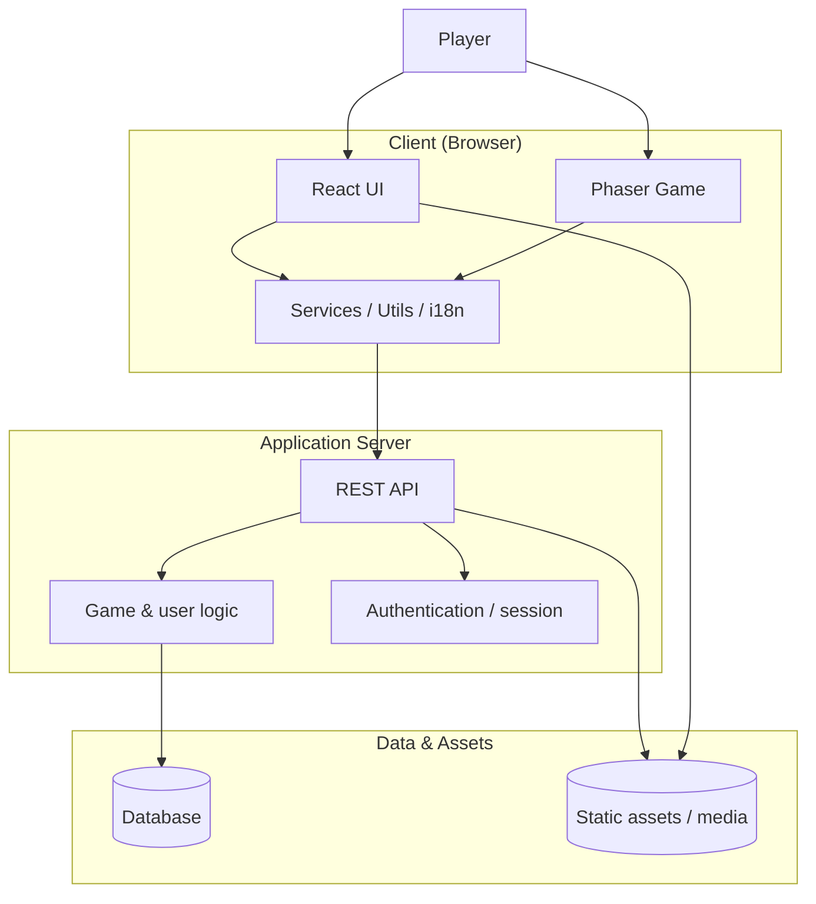
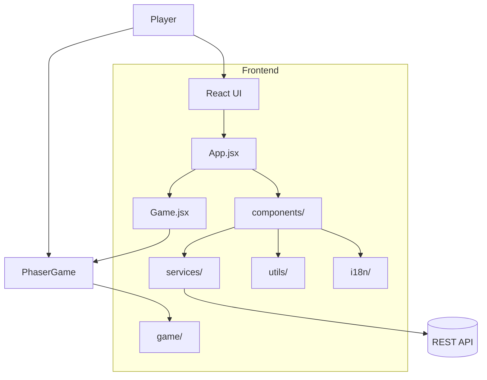
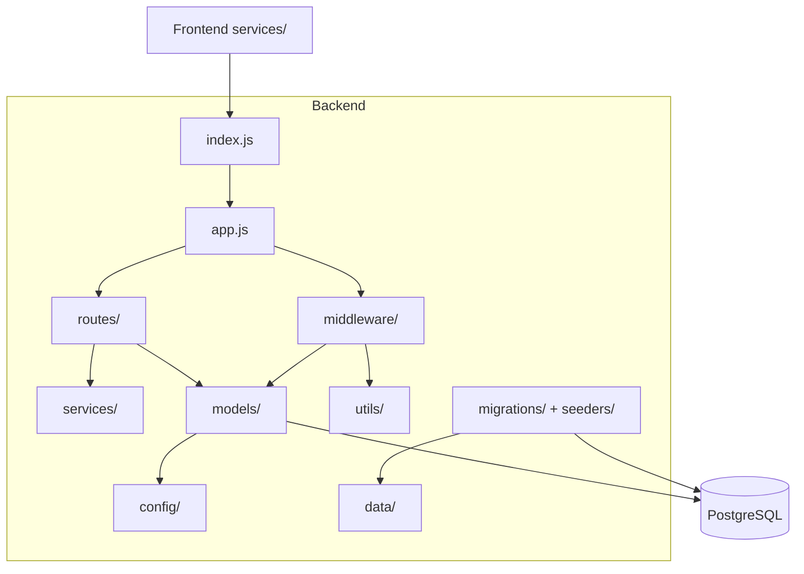
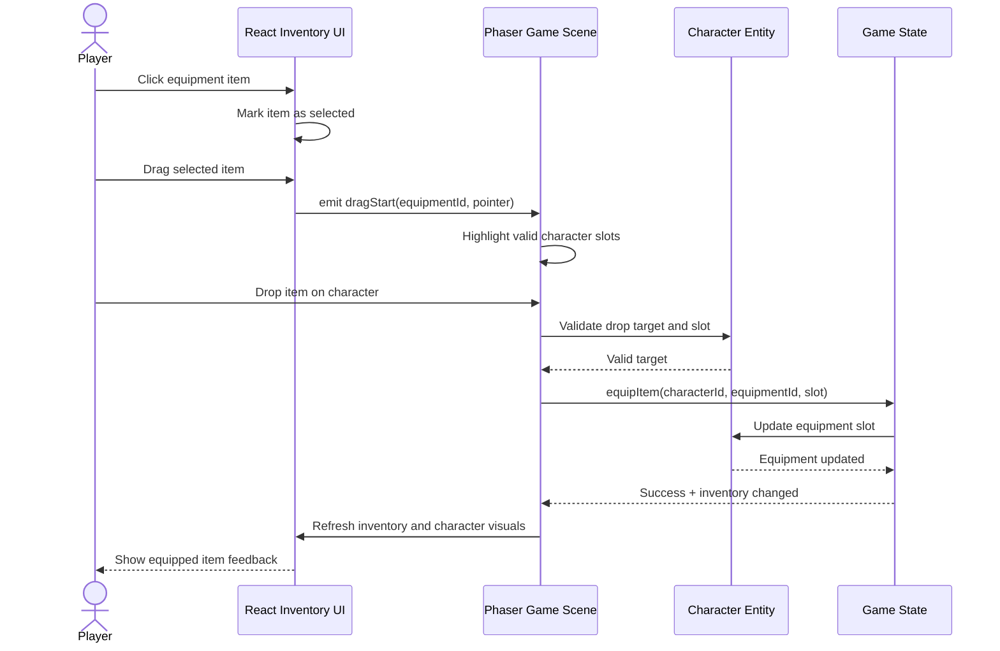
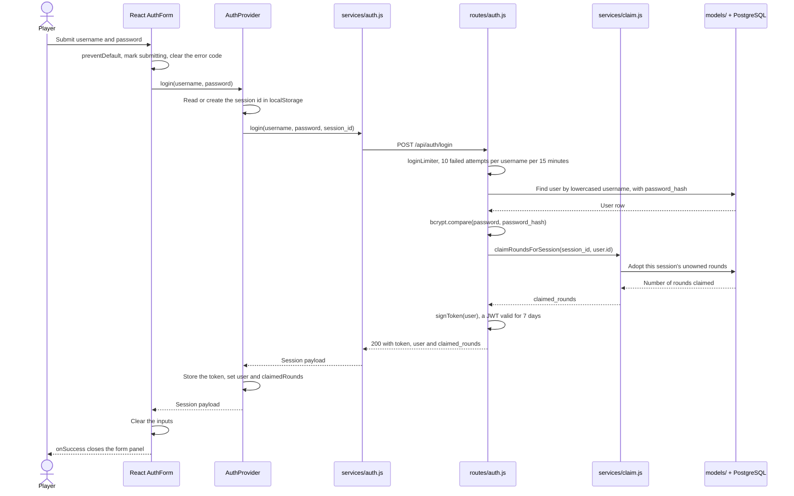
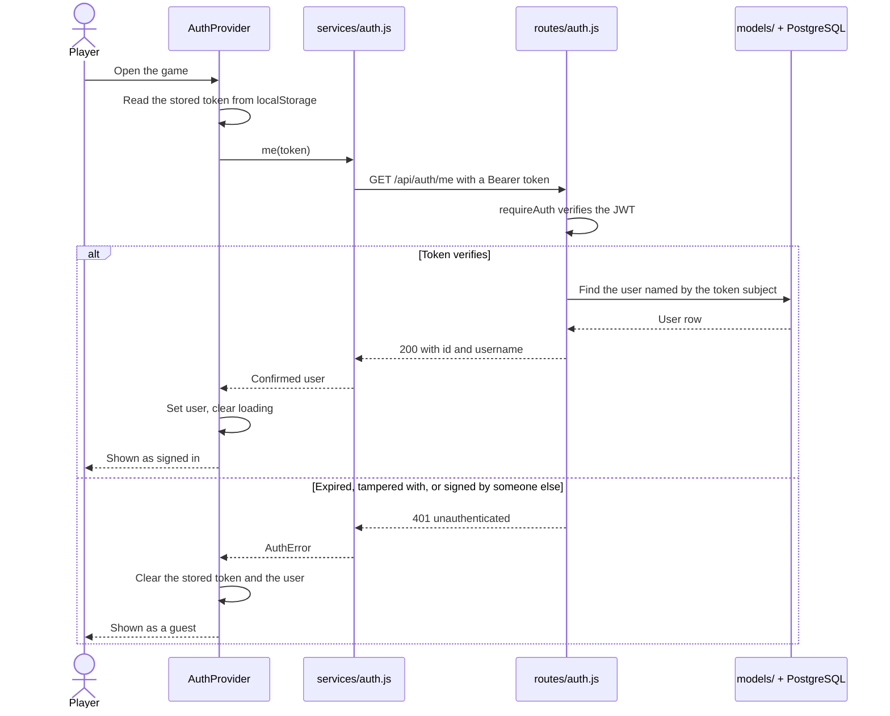

# Architecture

## Strenghts & Weaknesses in the project

**Weaknesses**

Structure:

Bugs:
- The character can go partly over the game area in BSL-2 and BSL-4 rooms.

**Strenghts**

Test coverage is high, and covers both frontend and backend

**Continuity plans&ideas**

New features that could be added
- Character moves more realistically --hands and legs moving
- Adjusting the player hitbox/room hitboxes
- Add lives in the game -- example: game ends automatically if you loose 3 lives
- The player can change the appearance of the character
- Feedback when exiting the game
- Tutorial guiding through the first round


## System architecture



## Deployment

- Docker
- Docker Compose

## Frontend

- React
- Vite
- Game engine: Phaser
- Bootstrap

### Frontend Component Diagram



## Backend

- Sequelize
- PostgreSQL
- Express

### Backend Component Diagram



## Database

The backend uses Sequelize against PostgreSQL. Schema lives in `backend/migrations/`, seed data in `backend/seeders/`.

Migrations and seeders run **automatically** when the stack starts: a one-off `migrate` service runs `npm run db:init` (`db:migrate && db:seed:all`) once Postgres is healthy, and the backend starts only after it finishes. Re-runs are safe — already-applied migrations and seeders are skipped.

```bash
docker compose up -d            # postgres → migrate (auto) → backend → frontend
```

Data persists in the `postgres_data` Docker volume across restarts. To wipe and re-seed from scratch:
```bash
docker compose down -v && docker compose up -d
```

### Endpoints

Content is served straight from `app.js`; the rest come from the routers it
mounts.

| Area | Endpoint | |
| --- | --- | --- |
| Content | `GET /api/bsl-classes` | The four levels and their required equipment |
| | `GET /api/microbes` | Every microbe |
| | `GET /api/microbes/random` | Draws one the session has not seen yet |
| | `GET /api/microbes/:id` | One microbe |
| | `GET /api/bsl-material` | The lecture room's material |
| | `POST /api/microbes/reset` | Clears the seen-microbe pool |
| | `POST /api/rooms/enter` | Records a room entry |
| Auth | `POST /api/auth/register` | Create an account |
| | `POST /api/auth/login` | Sign in, adopting the guest session's rounds |
| | `GET /api/auth/me` | Confirm a stored token |
| | `DELETE /api/auth/me` | Delete the account |
| Rounds | `POST /api/rounds` | Start or adopt a round |
| | `PATCH /api/rounds/:id` | Add an answer and re-grade |
| | `GET /api/me/rounds` | The signed-in player's rounds |
| Leaderboard | `GET /api/leaderboard` | Best round per user |

## Production

Production uses its own separate database and secret
(`bsl-backend-secret-prod`), requested and created the same way as the
staging one below but kept apart — see atk-tietokannat@helsinki.fi for
requesting a new production database.

Deploys to production are manual: pushing to main only updates staging.
Staging's imagestreams carry `scheduled: true`, so OpenShift re-imports
`:staging` on its own within about fifteen minutes. The production
imagestreams carry `scheduled: false` and never update by themselves.

### Promoting a build to production

> **The backend rollout runs migrations against the production database.**
> `backend/manifests/production/deployment.yaml` has a `db-init`
> initContainer running `npm run db:init`, so every promotion applies
> whatever migrations and seeders have landed since the last one. Check
> `backend/migrations/` for what is pending before you promote — an image
> can be rolled back, a migration cannot.

Requires eduroam or the university VPN.

```bash
oc login --web https://api.okd-cs-test-0.k8s.cs.helsinki.fi:6443
oc import-image bsl-backend-service-prod:production
oc import-image bsl-frontend-prod:production
```

`import-image` re-reads the `from.name` the imagestream already declares —
which is the moving `bslgame/bsl-<part>:staging` tag — so this promotes
whatever staging is running at that moment. Changing the tag fires the
deployment's `image.openshift.io/triggers` annotation and the rollout
starts on its own. Both parts have to be promoted; leaving one behind
gives you a mismatched production.

Check afterwards:

```bash
oc rollout status deploy/bsl-backend-prod
oc rollout status deploy/bsl-frontend-prod
```

To roll back, re-point the tag at the digest that was live before:

```bash
oc tag bslgame/bsl-backend:<git-sha> bsl-backend-service-prod:production --source=docker
```

For a release pinned to a known-good build rather than to whatever
staging holds, edit `from.name` in
`backend/manifests/production/imagestream.yaml` and
`frontend/manifests/production/imagestream.yaml` to that build's git-sha
tag, then `oc apply` and commit the change. CI pushes a `<git-sha>` tag
alongside `:staging` on every push to main, so any green build can be
named this way.

### JWT_SECRET

The backend signs session tokens with `JWT_SECRET` and **refuses to start without
it**. There is deliberately no built-in default: a secret living in this repository
could be used to forge a session token for any account. The only exception is
`NODE_ENV=test`, so the backend suite runs unconfigured.

`docker compose up` sets it for you. Running `npm start` straight from `backend/`
needs it in your environment:

```bash
JWT_SECRET=anything-local npm start
```

### Openshift guide

On OpenShift it comes from the `bsl-backend-secret` secret, and must be added
once before the next deploy — `backend/manifests/deployment.yaml` requires the
key, so without it the pod fails with `CreateContainerConfigError`:

```bash
oc create secret generic bsl-backend-secret \
  --from-literal=JWT_SECRET="$(openssl rand -base64 32)" \
  --dry-run=client -o yaml | oc apply -f -
```

That form patches the existing secret without disturbing `DB_URL`. Rotating the
value signs everyone out; nothing else breaks.

## Sequence diagrams

Player choosing a equipment and dragging it on the character



### Sequence diagram — signing in

A returning player signing in, and the guest rounds they played before signing in being
adopted by their account in the same request.



Registering is the same flow with validation first and a `201`, and it claims guest rounds
identically. Storing the new token also re-runs the provider's effect, so the confirmation
below follows every login.

### Sequence diagram — confirming a stored token

A player returning to a page they were already signed in on. The token outlives the tab, so
it has to be re-checked against the server before the player is treated as signed in.



The effect is keyed on the token alone, so it cannot tell a restored token from one a login
just produced — which is why it also runs after signing in, re-fetching a user the login
response already carried. A token whose user has since been deleted takes the same `401`
path.
