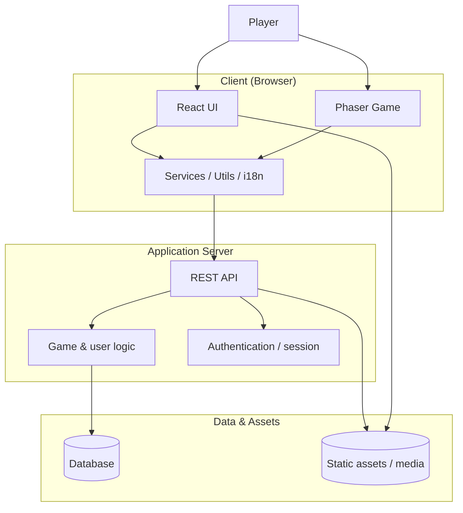
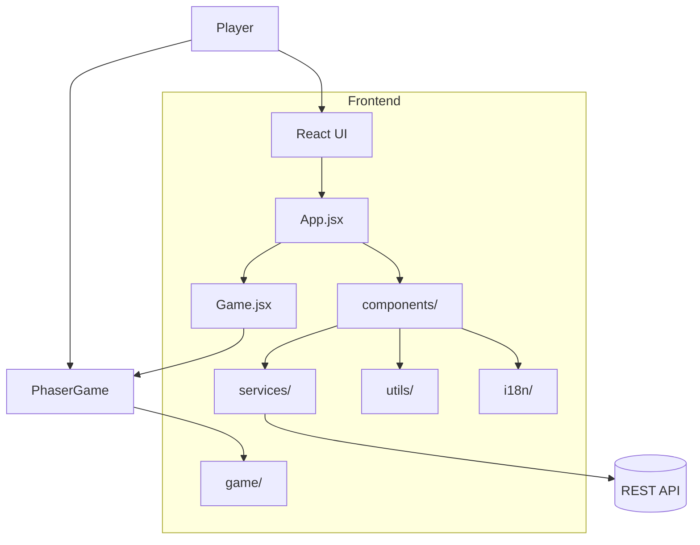
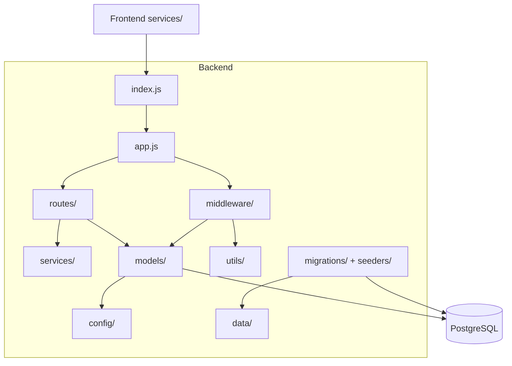
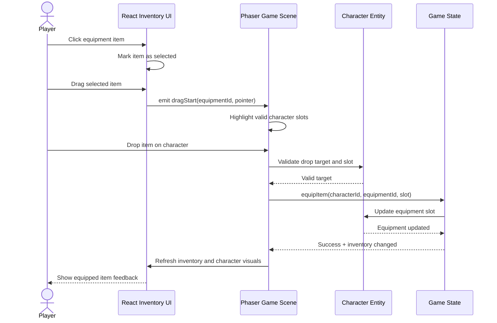

# Architecture

## System architecture



## Deployment

- Docker
- Docker Compose

## Frontend

- React
- Vite
- Game engine: Phaser
- Bootstrap

### Frontend Component Diagram



## Backend

- Sequelize
- PostgreSQL
- Express

### Backend Component Diagram



The levels read the same way as the frontend diagram above: caller, entry point, root
application, its two halves, the shared modules they lean on, and the store underneath.

Two real dependencies are left off so the levels stay flat. Routers attach `requireAuth` and
the rate limiters themselves, so `routes/` reaches `middleware/` as well as `app.js` does;
and `services/claim.js` writes through `models/`, though `grading.js` and `scoring.js` are
pure functions that touch nothing.

`migrations/` and `seeders/` are on a different lifecycle from everything above them: they
run once at startup, before the server accepts a request. See [Database](#database) below.

| Component | Files | Responsibility |
| --- | --- | --- |
| Entry point | `index.js` | Opens the port (`PORT`, default 3001) and nothing else |
| Application | `app.js` | Builds the Express app, applies `cors` + `express.json()`, mounts the routers, and serves the read-only content endpoints itself |
| `routes/` | `auth.js`, `rounds.js`, `leaderboard.js` | Register, log in, delete account; submit and re-grade rounds; best-round-per-user board |
| `middleware/` | `auth.js`, `rateLimit.js`, `errorHandler.js` | `requireAuth` / `optionalAuth`; per-username limiters on register and login; the last-resort error responder |
| `services/` | `grading.js`, `scoring.js`, `claim.js` | Grade one answer against the level's rules; score a microbe across its attempts; adopt a guest session's rounds on sign-in |
| `utils/` | `token.js` | Signs and verifies JWTs; refuses to load without `JWT_SECRET` outside `NODE_ENV=test` |
| `models/` | `index.js` + 7 model files | The single Sequelize instance and every association — the only component that talks to Postgres |
| `config/` | `config.js` | Resolves `DB_URL` or the discrete `DB_*` vars, and TLS when the URL asks for it |
| `data/` | `*.json` | Seed content (microbes and BSL material in en/fi/sv) plus the username blocklist |
| `migrations/`, `seeders/` | timestamped files | Schema changes and seed data, applied at startup rather than on any request |

The content endpoints living directly in `app.js` are `/api/bsl-classes`, `/api/microbes`,
`/api/microbes/random`, `/api/microbes/:id`, `/api/bsl-material` and `POST /api/rooms/enter`.
`errorHandler` is registered last, so anything a router throws lands there.

`services/grading.js` and `services/scoring.js` are deliberate ports of
`frontend/src/utils/equipmentRules.js` and `frontend/src/utils/scoring.js`: the client shows
the verdict, the server records it, and the two must agree.

**Not in the diagram — open PR [#108](https://github.com/BSL-Game-Group/BSL-game/pull/108)**
(`task/track_microbes`) adds a `rounds.seen_microbes` integer array, makes
`GET /api/microbes/random?session_id=…` draw only from microbes that session has not seen
yet (resetting once the pool is exhausted), adds `POST /api/microbes/reset`, and switches
`POST /api/rounds` from `Round.create` to `Round.findOrCreate` so it adopts the row
`/api/microbes/random` already made for that session. Nothing else in the backend moves.

## Database

The backend uses Sequelize against PostgreSQL. Schema lives in `backend/migrations/`, seed data in `backend/seeders/`.

Migrations and seeders run **automatically** when the stack starts: a one-off `migrate` service runs `npm run db:init` (`db:migrate && db:seed:all`) once Postgres is healthy, and the backend starts only after it finishes. Re-runs are safe — already-applied migrations and seeders are skipped.

```bash
docker compose up -d            # postgres → migrate (auto) → backend → frontend
```

Data persists in the `postgres_data` Docker volume across restarts. To wipe and re-seed from scratch:
```bash
docker compose down -v && docker compose up -d
```

Read endpoints: `GET /api/bsl-classes`, `GET /api/microbes`, `GET /api/microbes/:id`.

Production uses its own separate database and secret
(`bsl-backend-secret-prod`), requested and created the same way as the
staging one above but kept apart — see atk-tietokannat@helsinki.fi for
requesting a new production database.

Deploys to production are manual: pushing to main only updates staging.
To promote a build to production, edit `from.name` in
`backend/manifests/production/imagestream.yaml` and
`frontend/manifests/production/imagestream.yaml` to that build's
known-good git-sha tag, then `oc apply` and commit the change.

### `JWT_SECRET`

The backend signs session tokens with `JWT_SECRET` and **refuses to start without
it**. There is deliberately no built-in default: a secret living in this repository
could be used to forge a session token for any account. The only exception is
`NODE_ENV=test`, so the backend suite runs unconfigured.

`docker compose up` sets it for you. Running `npm start` straight from `backend/`
needs it in your environment:

```bash
JWT_SECRET=anything-local npm start
```

**On OpenShift it comes from the `bsl-backend-secret` secret, and must be added
once before the next deploy** — `backend/manifests/deployment.yaml` requires the
key, so without it the pod fails with `CreateContainerConfigError`:

```bash
oc create secret generic bsl-backend-secret \
  --from-literal=JWT_SECRET="$(openssl rand -base64 32)" \
  --dry-run=client -o yaml | oc apply -f -
```

That form patches the existing secret without disturbing `DB_URL`. Rotating the
value signs everyone out; nothing else breaks.

### Sequence diagram

Player choosing a equipment and dragging it on the character


