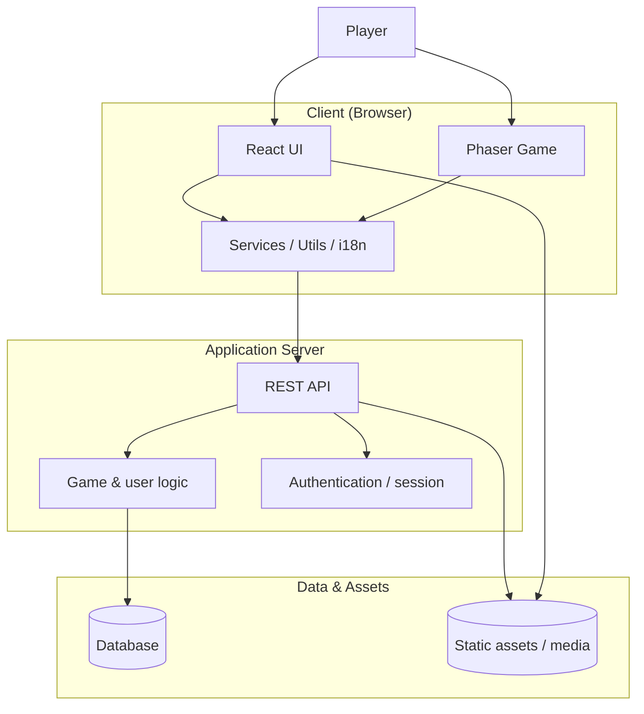
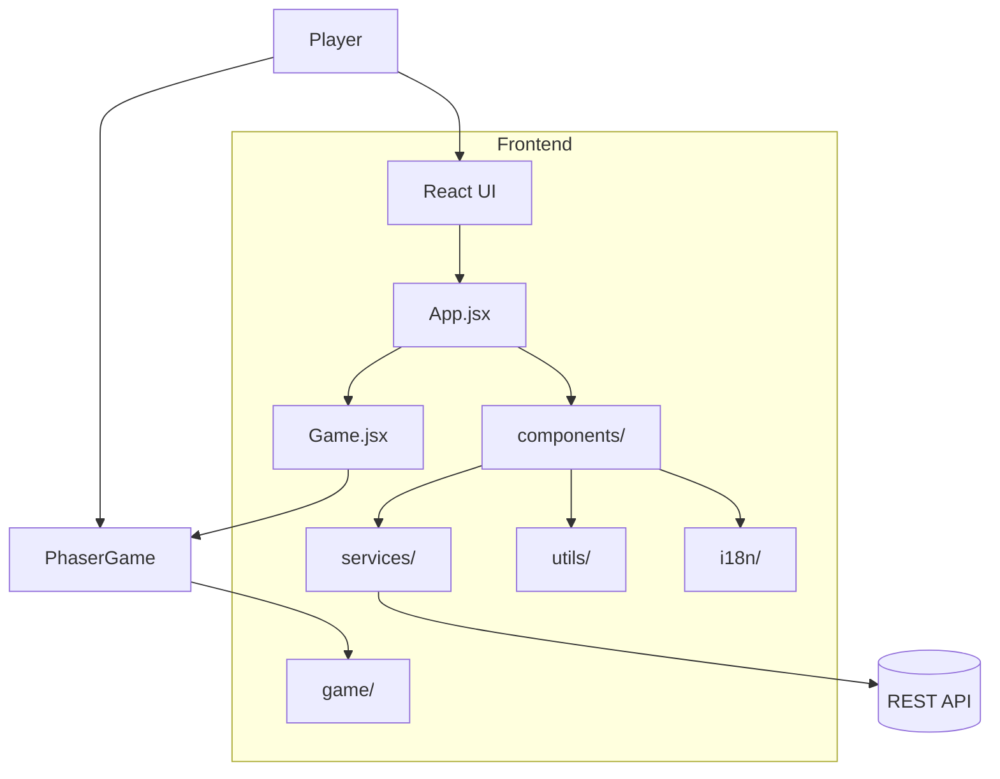
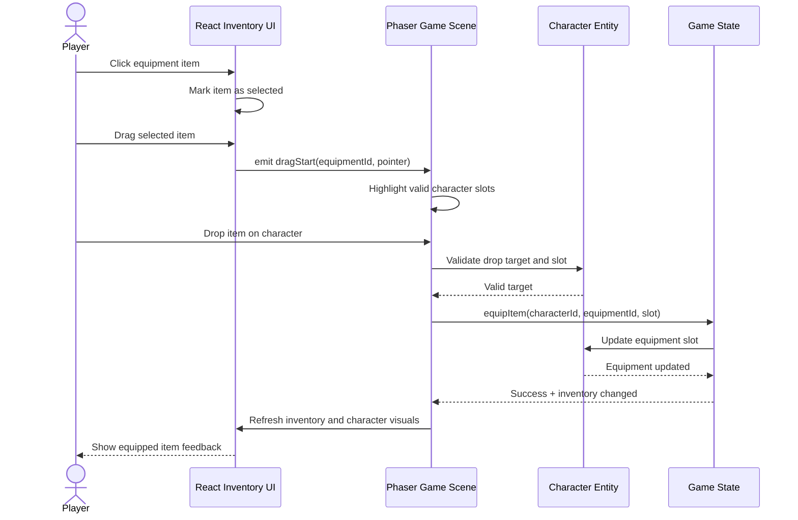

# Architecture

## System architecture

## Deployment

- Docker
- Docker Compose

## Frontend

- React
- Vite
- Game engine: Phaser
- Bootstrap

### Frontend Component Diagram

## Backend

- Sequalize
- PostreSQL
- Express

### Sequence diagram

Player choosing a equipment and dragging it on the character

### Entity relationship diagrams

### Class diagrams