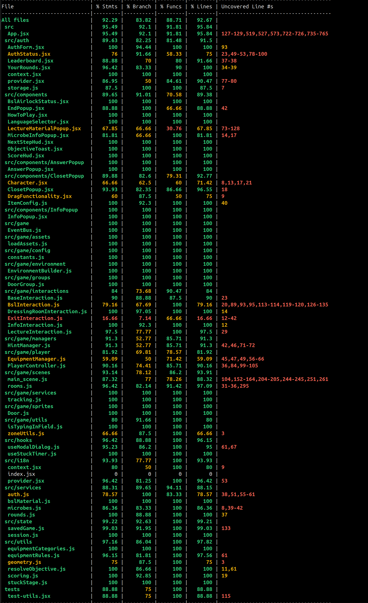
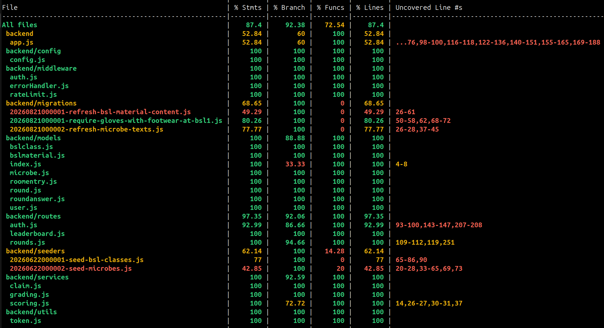

# Testing

## Structure

The game has end-to-end tests made with Playwright. Jest and React Testing Library cover the frontend logic and component behaviour.

## Coverage

Test coverage goal: 80%

[](https://codecov.io/github/BSL-Game-Group/BSL-game)
[](https://app.codecov.io/github/BSL-Game-Group/BSL-game/flags/frontend)
[](https://app.codecov.io/github/BSL-Game-Group/BSL-game/flags/backend)

Frontend:


Backend:


## Test instructions

Install dependencies:
```bash
npm install
```
Install the Playwright browsers. `npm install` does not fetch them, and the
end-to-end run fails with `Executable doesn't exist` until you do this once:
```bash
npm run test:browsers
```
start the game:
```bash
docker compose up --build -d
```

Run end-to-end Playwright tests:
```bash
npm test
```
Run tests with UI:
```bash
npm run test:ui
```
frontend unit tests (run from the repo root):
```bash
npm --prefix frontend test
```

Backend unit tests. **These talk to a real Postgres**, so start the database and
create the test database once:
```bash
docker compose up -d postgres
docker compose exec -T postgres psql -U bsluser -d bsldb -c "CREATE DATABASE bsldb_test"
```

Then, from `backend/`:
```bash
npm run test:db:prepare   # migrate + seed bsldb_test (re-run after new migrations)
npm test
```

The backend's own `npm test` — the one run from `backend/`, not the Playwright
run at the repo root — sets `NODE_ENV=test` and blanks `DB_URL`, so it can never
touch the development database. `bsldb_test` is separate from `bsldb` and is
safe to drop and rebuild at any time.
