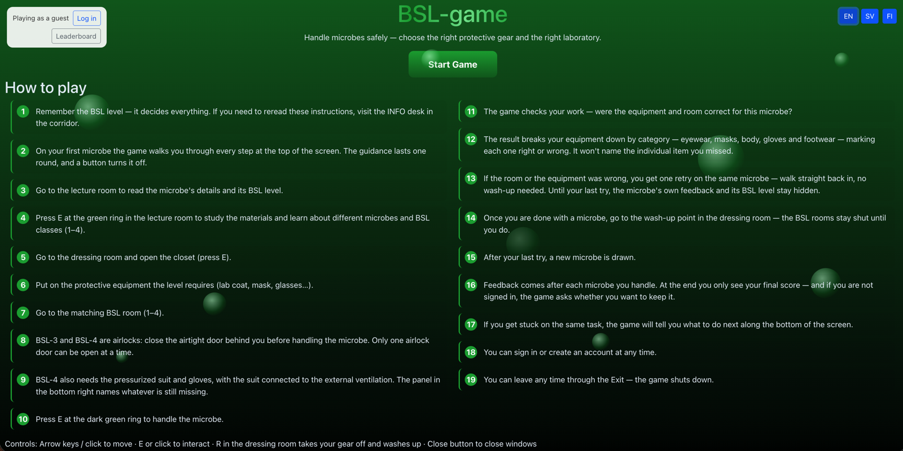
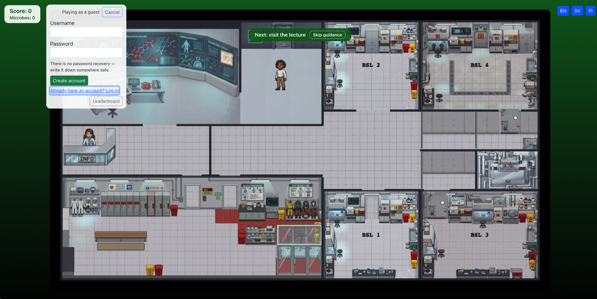
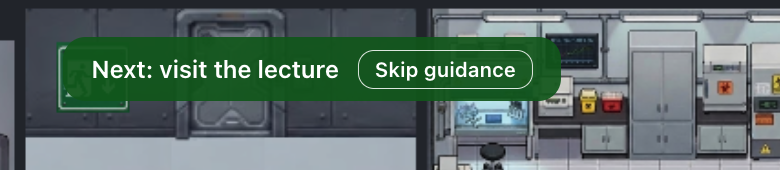
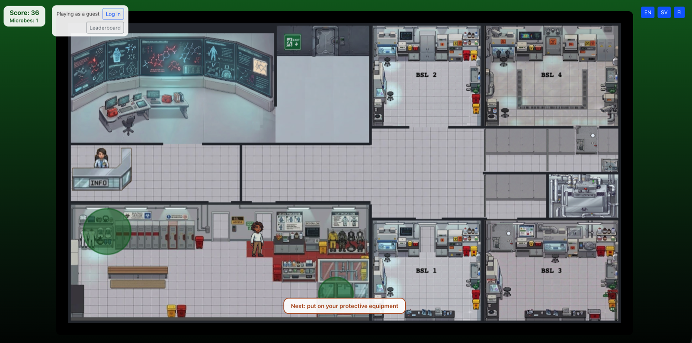
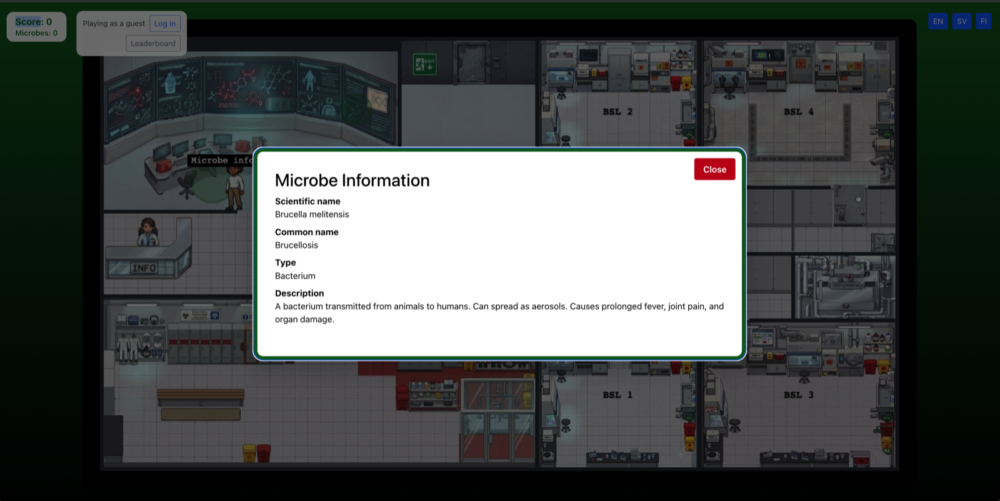
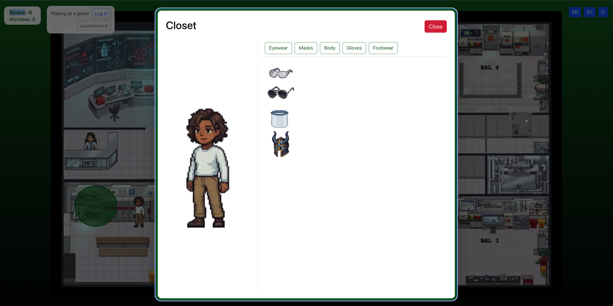
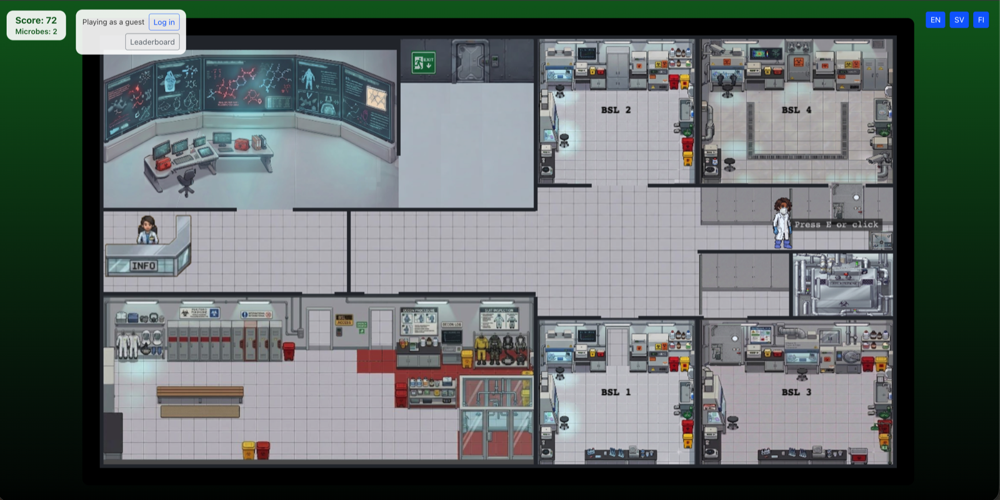
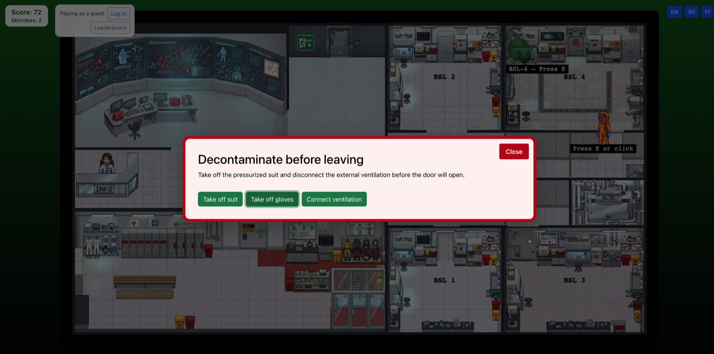
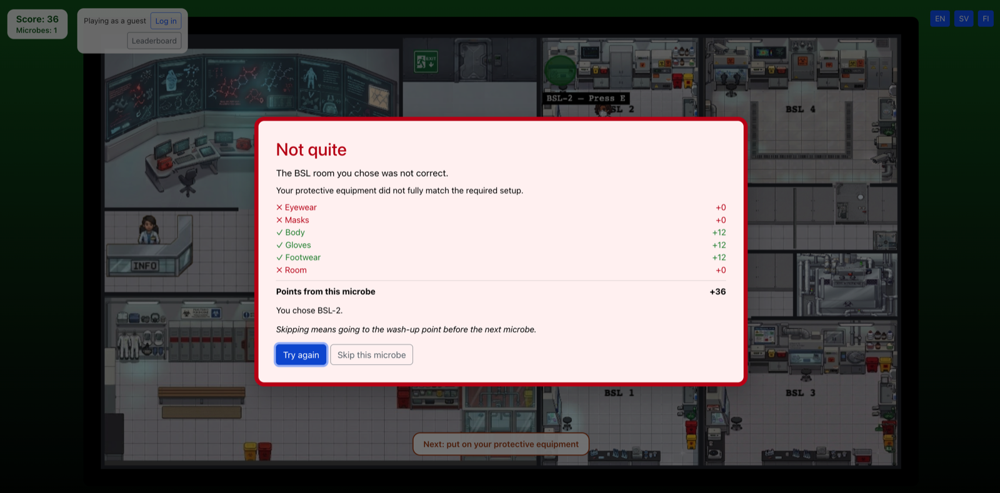
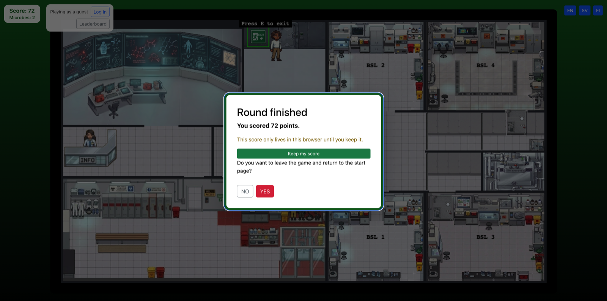

# User instructions

BSL-game is about handling microbes safely: for each microbe you have to choose
the right protective gear and the right laboratory. **Remember the BSL level —
it decides everything.** If you want to reread the instructions during play,
visit the INFO desk in the corridor.

## Controls

| Action | Control |
| --- | --- |
| Move | Arrow keys, or click where you want to go |
| Interact | E, or click the ring |
| Take your gear off and wash up | R, in the dressing room |
| Close a window | The Close button |

## Starting the game

Read the instructions on the front page, and set your language in the top right
corner. The game is available in English, Finnish and Swedish.

The game starts after pressing the "Start Game" button.

### Creating an account

You can log in and save your progress from the top right corner of the front
page. You do not have to decide now — you can also do it during the game, or
when you quit.

Logging in is optional.

There is no password recovery, so write your password down somewhere safe.

Until you sign in the game calls you a guest, and the **Leaderboard** button
beside the login controls shows the best rounds so far.

### Guidance on your first microbe

On your first microbe the game walks you through every step at the top of the
screen. The guidance lasts one round, and a button turns it off if you would
rather find your own way.

The banner sits at the top of the screen and names the next thing to do — here
"Next: visit the lecture". The **Skip guidance** button beside it turns the
guidance off for good.

## Moving

The character moves with the arrow keys, or by clicking where you want to go.

The score and the number of microbes handled sit in the top left corner
throughout.

## The lecture room

Go to the lecture room to read the microbe's details. This is the first stop of
every round — the game will not let you handle a microbe you have not read
about.

Press E at the green ring in the lecture room to study the materials and learn
about different microbes and BSL classes (1–4).

The card gives you the scientific name, the common name, the type and a
description. It does **not** tell you the BSL level — working that out from the
description is the whole task. The level stays hidden until your last try on
that microbe, and comes with the result.

## Dressing and undressing protective gear

Go to the dressing room and open the closet by pressing E. Put on the protective
equipment the level requires — lab coat, mask, glasses and so on.

Put gear on by clicking it, or by dragging it onto the character. Taking it off
works the same way.

The closet is organised by the same five categories the result will grade you
on: Eyewear, Masks, Body, Gloves and Footwear. The character preview on the left
shows what you are currently wearing.

## Entering a BSL room

Go to the BSL room that matches the microbe's level (1–4). Getting the room
wrong counts as a wrong answer just like getting the gear wrong.

The whole laboratory is on screen the whole time, so all four rooms are in view
from wherever you are standing — see the map under [Moving](#moving).

### Airlocks: BSL-3 and BSL-4

BSL-3 and BSL-4 are airlocks: close the airtight door behind you before handling
the microbe. Only one airlock door can be open at a time, so the room will
refuse to let you work until the door you came through is shut.

The airlock is an antechamber between the corridor and the laboratory. Each door
prompts "Press E or click" when you stand at it — step in, shut the door behind
you, and only then open the one ahead.

### BSL-4: suit, gloves and ventilation

BSL-4 also needs the pressurized suit and gloves, with the suit connected to the
external ventilation. All three are handled from a popup of their own, with a
button for each: **Take off suit**, **Take off gloves** and **Connect
ventilation**.

If you lose track of what is still missing, the status panel in the bottom right
corner names it.

Getting out of BSL-4 is the same procedure in reverse. The door will not open
until you have taken the pressurized suit off and disconnected the external
ventilation, and the game says so — "Decontaminate before leaving" — rather than
leaving you to guess why the door is stuck.

## Handling the microbe

Press E at the dark green ring to handle the microbe. The ring is labelled with
the room and the key — "BSL-2 — Press E" — so you can tell at a glance which
room you are standing in.

## Checking your answer

The game checks your work — were the equipment and room correct for this
microbe?

The result breaks your equipment down by category — eyewear, masks, body,
gloves and footwear — marking each one right or wrong. It won't name the
individual item you missed.

The room you chose is listed as a row of its own alongside those categories, and
each row carries the points it earned, with the total for the microbe underneath.

## Retrying

If the room or the equipment was wrong, you get one retry on the same microbe —
walk straight back in, no wash-up needed. Until your last try, the microbe's own
feedback and its BSL level stay hidden.

The result offers two ways on: **Try again** takes the retry, and **Skip this
microbe** gives it up. Skipping means going to the wash-up point before the next
microbe, so the retry is the cheaper of the two.

Both buttons are at the bottom of the result popup shown above.

## Washing up

Once you are done with a microbe, go to the wash-up point in the dressing room —
the BSL rooms stay shut until you do. After your last try, a new microbe is
drawn.

## If you get stuck

If you get stuck on the same task, the game will tell you what to do next along
the bottom of the screen. You do not have to ask for it — wait a moment and the
hint appears on its own.

In the laboratory screenshot under [Moving](#moving) the hint reads "Next: put on
your protective equipment", and the ring it is pointing at glows green.

## Score and saving your result

Feedback comes after each microbe you handle. At the end you only see your final
score — and if you are not signed in, the game asks whether you want to keep it.

The round ends with a **Round finished** popup naming your score. Until you press
**Keep my score** that score only lives in this browser, so keep it before you
leave if you want it on the leaderboard. You can sign in or create an account at
any time, so an unplanned good run does not have to go unsaved.

## Exit the game

You can leave any time through the Exit, in the top middle of the laboratory. It
prompts "Press E to exit" when you stand at it, and then asks whether you want to
leave the game and return to the start page — the same popup as above.
